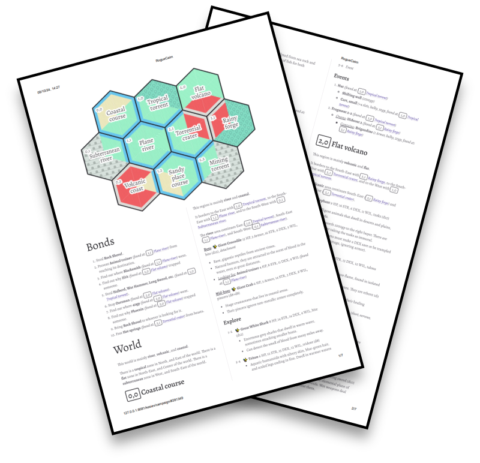
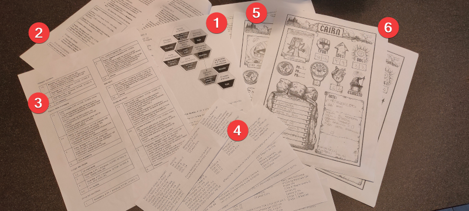

# RogueCairn

An opensource random generator of small worlds designed to be explored following Yochai Gal's adventure game Cairn rules.

---

<a href="https://www.kesiev.com/roguecairn/">Generate a quest</a>

---

## The project

**RogueCairn** is an opensource random generator of small worlds designed to be explored following [Yochai Gal](https://x.com/yochaigal1)'s [Cairn](https://cairnrpg.com/) [adventure game](https://questingblog.com/adventure-game-vs-osr/). _Cairn_ is a game about exploring a dark and mysterious Wood filled with strange folk, hidden treasure, and unspeakable monstrosities. Generated worlds can be used as a basis for preparing a one-shot, as inspiration for your narratives, or as an emergency adventure to print and play.

    

The world is generated rolling on multiple manually tagged and interconnected data tables (items, monsters, places, etc.) following some rules to keep some things coherent and balanced in a [roguelike](https://en.wikipedia.org/wiki/Roguelike) fashion.

This way **RogueCairn** vaguely explains the _what_ of a small generated world. It's up to you as the _Warden_ and your fellow _adventuring party_ to create a fitting _lore_ explaining the _how_ and _why_ - in advance or as you go.

But, as for many other RPG tools, you can do anything you want with them: create backstories, prepare one-shots, roll a character and explore them by yourself, or just feed your imagination.

### Tips

**RogueCairn** wants you as a Warden and your adventuring party to play with its _vagueness_ and _randomness_:

 * It decides the _what_ but guessing the rest is up to you: in a _dungeon_, a _Mimic_ is looking for a _Speakstick_... but why? Get inspired by the descriptions of the items and beasts and the place's name to create an interesting backstory! Why a _malicious shape shifter_ in _a dungeon_ wants to know the _unfinished business of a ghost_? Maybe it is _a fake chest_ looking for its content stolen by _a dead adventurer_ hoarding its _home_?
 * It also intentionally uses vague terms for some items. Is that _container_ a _shiny treasure chest_ or an _anonymous wooden box_? Is that _hideout_ a _statue of a Goddess with a scale in hand_ or just a _tiny hole in a wall_? Are those _fragments_ the _parts of an amulet_ or _two twin statues_? Be creative!
 * Each world region has a short description, a set of bosses and mid-bosses living there, an exploration table, and an events list. Feel free to use them as you want: you may read the description and roll on the exploration table, pick a boss or an event as the adventuring party reach a region, or ignore these tools entirely.
 * Beasts with a sparkles icon ✨ are thematically related with one of the region biomes and beasts with a star emoji ⭐ are related to both region biomes! Use this information to create leaders, natives, etc.

### Why?

In my 20s I spent my evenings coding, playing video games, drinking a good beer, crying, and rolling dice with friends playing _Dungeons & Dragons_.

A long time has passed and I've lost track of most of them. One day _Matteo_ wanted to drag a bunch of us again to the table and play a _one-shot_ to _bring that good times back_.

In these years I've managed to keep my interest on RPGs - mostly design-wise - so he suggested me as a master. The party wanted a _classic fantasy_ settings as we used to play but now we all have jobs and some of us have children too, so _no one_ had time to study any rulebook of any size.

Some time ago I've studied _Yochai Gal_'s [Cairn](https://cairnrpg.com/) and it fitted like a glove: it distills the core mechanics and rituals of classic RPG in a few solid rules that can be explained in minutes _even as you play_.

    

    
The material I've prepared for my <i>The Ritual of The Three</i> one-shot: a hexcrawl of the quest area (1), a few sheets with bullet-point lists of possible key story events and characters (2), a simple encounter table for each zone (3), randomized character recaps to hand down to the players - I've shared them with the players by chat some days before (4), a sample filled character sheet for them to copy (5), and some once-empty character sheets (6). In the photo, the half-elf Ethex Harkness character sheet by <i>Alberto</i>.

I prepared a one-shot called _The Ritual of the Three_ inspired by the [Massive Randomness](https://github.com/kesiev/massive-randomness-2/) lore, following multiple suggestions I've found around the internet (using names and character rolling tools, planning small hexcrawls to set locations, preparing simple rolling tables for each area, etc.) and from the _Cairn_ manual.

It has been a fun experience and I've learned a lot. Then, something went horribly wrong.

In that adventure, a forgotten noble managed to infiltrate the party and sacrifice 3 heroes' lives to wake the Faceless, the Old Red One, and the Cube during a ritual hidden in the _Cairn_ woods.

The traitor's name had its past glory back... but now _Cairn_ has been tainted by the _Massive Randomness_ corrupting _Entropy_. You can use **RogueCairn** to see it with your eyes.

### Data sources

**RogueCairn** uses both ad-hoc data and data coming from multiple data sources:

 * [Cairn manual](https://cairnrpg.com/)
   * Cairn manual [More Relics](https://cairnrpg.com/resources/more-relics/) page
     * Includes data from [Glass Bird Games](https://glassbirdgames.blogspot.com/)
     * Includes data from _Ialath_
     * Includes data from _The NSR Discord_
   * Cairn manual [Monsters](https://cairnrpg.com/resources/monsters/) page
   * Cairn manual [More Equipment](https://cairnrpg.com/resources/more-equipment/) page (crediting [Oskar Swida](https://oskarswida.itch.io/))
 * The [Kettlewright tool](https://github.com/yochaigal/kettlewright) sources
 * Cairn manual [Italian translation](https://it.cairnrpg.com/cairn-srd/)
 * The [2e backgrounds Italian translation](https://sbax.itch.io/cairn-2e-background-ita) by [Sbax](https://sbax.itch.io/)

### Credits

Thanks to _Bianca_ (Lisabeth Glass, the rat-shifting druid), _Matteo_ (Ygwal Abernathy, the jingling minstrel), _Enea_ (Mannog Tolmen, the forgotten halfling noble), _Alberto_ (Ethex Harkness, the half-elf of the pact), and _Elena_ (Emrys Swinney, the rich adventuring ranger) for their bravery.
